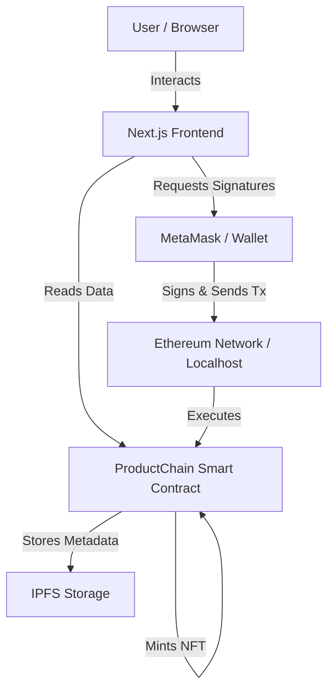
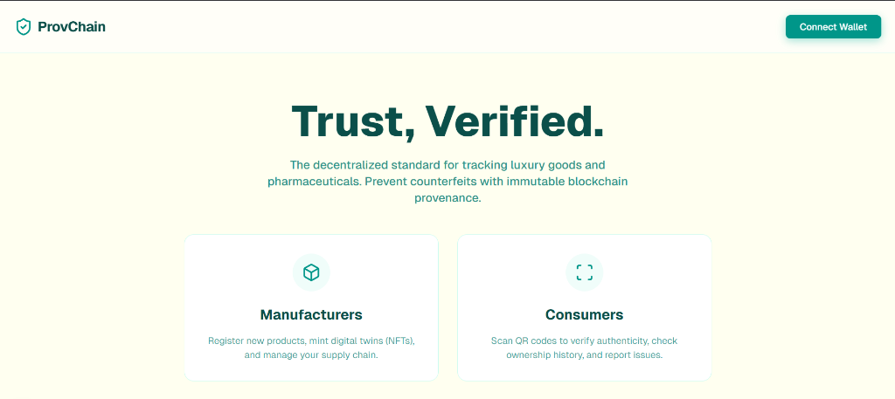
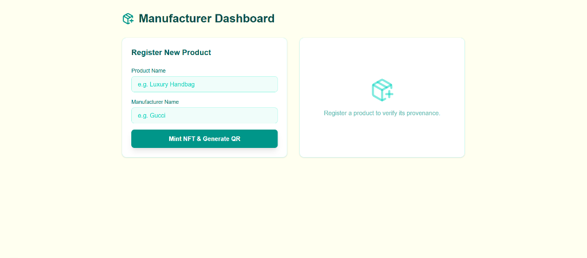
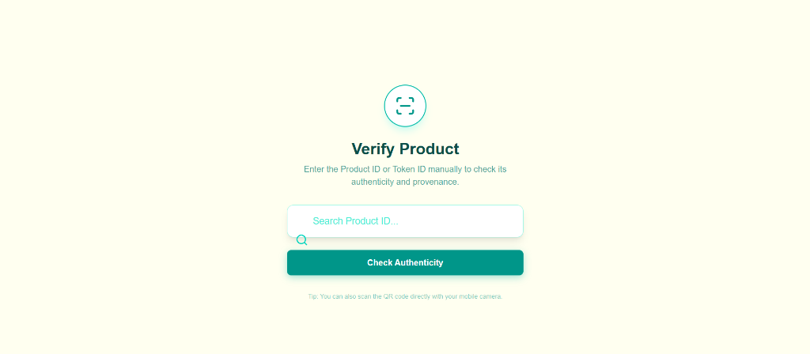
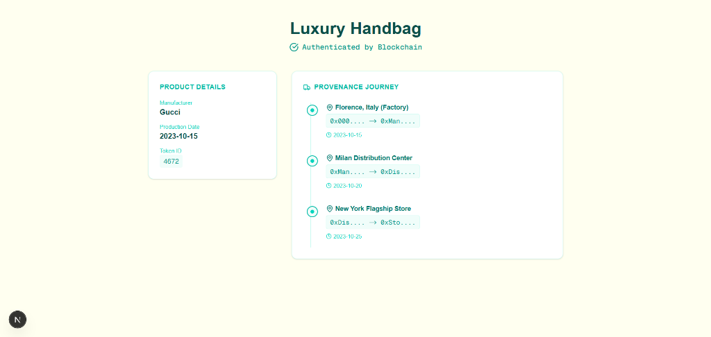

# Supply Chain & Provenance dApp

A decentralized application (dApp) for tracking the lifecycle of luxury goods and pharmaceuticals. This project utilizes NFTs (ERC-721) to create digital twins of physical products, ensuring authenticity and providing an immutable history of ownership.


## 🌟 Features

### For Manufacturers
- **Product Registration**: Mint unique NFTs representing physical goods.
- **Digital Twin Creation**: Assign metadata (Name, Manufacturer, Date) to each token.
- **QR Code Generation**: Automatically generate QR codes for physical tagging.

### For Consumers
- **Provenance Verification**: Scan QR codes or enter ID to verify authenticity.
- **Ownership History**: View the complete journey of a product from factory to store to current owner.
- **Visual Timeline**: Interactive map/timeline of the product's transfer history.

### For Developers
- **Secure Architecture**: Built on Ethereum (Hardhat) standards.
- **Modern UI**: sleek Teal & Ivory aesthetics using TailwindCSS.
- **Type-Safe**: Full TypeScript implementation.

---

## 🏗 Architecture

The application follows a standard Web3 dApp architecture:



---

## 🚀 Getting Started

### Prerequisites

- **Node.js**: v18+ (LTS recommended)
- **MetaMask**: Browser extension installed.
- **Git**: For version control.

### Installation

1. **Clone the Repository**
   ```bash
   git clone https://github.com/Sanjog-Poojary/DocReview.git
   cd DocReview
   ```

2. **Install Dependencies**
   
   *Frontend:*
   ```bash
   cd frontend
   npm install
   ```

   *Smart Contracts:*
   ```bash
   cd ../contracts
   npm install
   ```

### Running Locally

1. **Start Local Blockchain**
   ```bash
   cd contracts
   npx hardhat node
   ```

2. **Deploy Contracts**
   Open a new terminal:
   ```bash
   cd contracts
   npx hardhat run scripts/deploy.js --network localhost
   ```
   *Note the deployed address!*

3. **Configure Frontend**
   Update `frontend/src/lib/web3.ts` with your deployed contract address.

4. **Start Web App**
   ```bash
   cd frontend
   npm run dev
   ```
   Visit `http://localhost:3000`.

---

## 📜 Smart Contract Documentation

The `ProductChain.sol` contract handles the core logic.

### Core Functions

#### `createProduct`
Mints a new NFT and initializes its history.
```solidity
function createProduct(
    string memory name, 
    string memory manufacturer, 
    string memory tokenURI
) public returns (uint256)
```

#### `transferProduct`
Transfers ownership and records the location/context of the transfer.
```solidity
function transferProduct(
    address to, 
    uint256 tokenId, 
    string memory location
) public
```

#### `getProduct`
Retrieves static details about a product.
```solidity
function getProduct(uint256 tokenId) public view returns (
    string memory name,
    string memory manufacturer,
    uint256 manufactureDate,
    address currentOwner
)
```

#### `getProductHistory`
Returns the full array of transfer records.
```solidity
function getProductHistory(uint256 tokenId) public view returns (TransferRecord[] memory)
```

### Events

- `event ProductCreated(uint256 indexed tokenId, string name, address indexed manufacturer);`
- `event ProductTransferred(uint256 indexed tokenId, address indexed from, address indexed to, string location);`

---

## 📸 Screenshots

*Placeholders for feature demonstration:*


1. **Landing Page**
   

2. **Manufacturer Dashboard**
   

3. **Consumer Verification**
   

4. **Product Provenance**
   


---

## 📄 License

Distributed under the MIT License. See `LICENSE` for more information.
